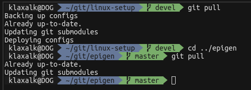

# Dotprofiler
 
creating profiles in linux dotfiles

## Description 

## Premise

This piece of software allows to create profiles in linux _dotfiles_.
  The profiles can be maintained within a single branch on git, which streamlines the proces of sharing configuration between various devices and even users, both of which might need minor customizations in othewise mostly universal set of files.
  The authors personal experience suggests that maintaining minor customizations in git branches often leads to difficult rebasing, which generally slows down the process of pushing new changes from any devices to any other device, resulting in fractured setup.
  Thus appeared the idea to contain each version of the configuration within the file.
  The section will be activated by uncommenting it only on the device (or by a user) which it is meant for.
  Dotprofiler takes care of automatic commenting/uncommenting of sections of dotfiles via an updated _git_ command with custom hooks.

  ## Dependencies

    Dotprofiler depends (through [epigen](https://github.com/klaxalk/epigen)) on
  1. **bash**,
  2. **vim** (7.0 or higher).
  No speial configuration is needed for either of those.

  Epigen utilizes Tim Pope's [vim-commentary](https://github.com/tpope/vim-commentary) vim plugin, which has been integrated in the epigen's .vimrc.

  ## How to

  1. The dotfiles, containing profile-specific code, should follow [epigen](https://github.com/klaxalk/epigen)'s syntax.
  2. Dotprofiler expects a list of profiles (that should be activated) as exported variables (presumably set in .bashrc/.zshrc file).
     Those are _PROFILER_ADDITIONS_ (effects only uncommenting), _PROFILER_DELETIONS_ (effects only commenting out) and _PROFILER_BOTH_ (effects both commenting out and uncommenting). Example follows:
     ```
     export PROFILER_ADDITIONS=""
     export PROFILER_DELETIONS="SPECIFIC_SETTING1"
     export PROFILER_BOTH="JOHN LAPTOP"
     ```
  3. The dotfiles, which should be handled by dotprofiler, should be listed within a config file.
     Each line should contain the original path of the file (presumably in git repo), the local path (elsewhere, or ignored by git) and the commenting style descriptor for the particular syntax of the file (see [epigen](https://github.com/klaxalk/epigen)).
     The file might look like this:
     ```
     $GIT_PATH/linux-setup/appconfig/vim/dotvimrc, ~/.vimrc, \"\ %s
     $GIT_PATH/linux-setup/appconfig/urxvt/dotXresources, ~/.Xresources, \!\ %s
     $GIT_PATH/linux-setup/appconfig/bash/dotbashrc_git, $GIT_PATH/linux-setup/appconfig/bash/dotbashrc, \#\ %s
     $GIT_PATH/linux-setup/appconfig/zsh/dotzshrc_git, $GIT_PATH/linux-setup/appconfig/zsh/dotzshrc, \#\ %s
     ```
  4. Dotprofiler might be called either manually (see Examples) or hooked up to _git pull_ or other git commands.

  # Examples

  ## Calling dotprofiler manually

  An example can be seen in **./example** subfolder.

  The script **deploy_configs.sh** deploys the _my_config.txt_ file to /tmp while it activates the _TEST1_ profile for both additions and deletions:
  ```bash
  # make the script run in bash/zsh while having the dotfile sourced
  PNAME=$( ps -p "$$" -o comm= )
  SNAME=$( echo "$SHELL" | grep -Eo '[^/]+/?$' )
  if [ "$PNAME" != "$SNAME" ]; then
    exec "$SHELL" "$0" "$@"
    exit "$?"
  else
    source ~/."$SNAME"rc
  fi

  export PROFILER_ADDITIONS=""
  export PROFILER_DELETIONS=""
  export PROFILER_BOTH="TEST1"

  ../dotprofiler.sh deploy example_file_list.txt
  ```

  The script **backup_config.sh** backups the same config file back while it unsets all profiles to the default state:
  ```bash
  # make the script run in bash/zsh while having the dotfile sourced
  PNAME=$( ps -p "$$" -o comm= )
  SNAME=$( echo "$SHELL" | grep -Eo '[^/]+/?$' )
  if [ "$PNAME" != "$SNAME" ]; then
    exec "$SHELL" "$0" "$@"
    exit "$?"
  else
    source ~/."$SNAME"rc
  fi

  ../dotprofiler.sh backup example_file_list.txt
  ```

  ## Automating with **git**

  Hooking up dotprofiler to git might seem to be possible using _git hooks_, however I struggled to find a solution, which could run custom commands both before and after _pull_, _checkout_ and _reset_.
  This can be solved by custom git alias, which can also contain other usefull stuff, e.g., updating submodules after pulling, etc.
  Please be inspired:
  ```bash
  git() {

    case $* in pull*|checkout*|"reset --hard")

      # give me the path to root of the repo we are in
      ROOT_DIR=`git rev-parse --show-toplevel` 2> /dev/null

      if [[ "$?" == "0" ]]; then

        # if we are in the 'linux-setup' repo, use the dotprofiler
        if [[ "$ROOT_DIR" == "$GIT_PATH/linux-setup" ]]; then

          DOTPROFILER="$GIT_PATH/linux-setup/submodules/dotprofiler/dotprofiler.sh"

          bash -c "$DOTPROFILER backup $GIT_PATH/linux-setup/appconfig/dotprofiler/file_list.txt"

          command git "$@"

          case $* in pull*)
            echo "Updating git submodules"
            command git submodule update --init --recursive
          esac

          if [[ "$?" == "0" ]]; then

            bash -c "$DOTPROFILER deploy $GIT_PATH/linux-setup/appconfig/dotprofiler/file_list.txt"

          fi

        else
          command git "$@"
          case $* in pull*)
            echo "Updating git submodules"
            command git submodule update --init --recursive
          esac
        fi

      else
        command git "$@"
        case $* in pull*)
          echo "Updating git submodules"
          command git submodule update --init --recursive
        esac
      fi

      ;;
    *)
      command git "$@"
      ;;

    esac
  }
  ```

  then, when running e.g. _git pull_, it should look like on the following image.
  The first _git pull_ shows the alias withing a folder with dotprofiler, the other in just a general git repository.

  
